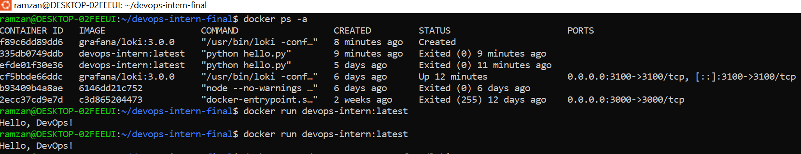
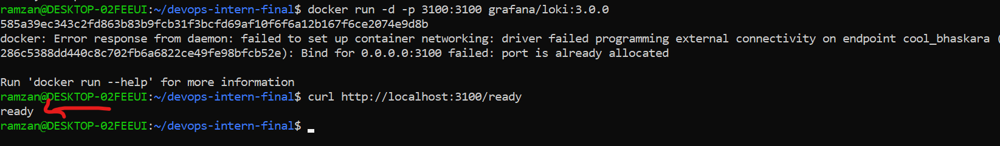

# DevOps Intern Final Assessment

### Personal Details
* **Name:** Muhammad Ramzan
* **Date:** 08/06/2026
* **Role:** DevOps Intern
* **Time Zone:** PKT (GMT+5)

---

## Project Description
This repository contains the complete practical implementation for the DevOps Intern Final Assessment. The goal of this project is to build, document, and monitor a structured end-to-end DevOps pipeline using modern open-source tools.

The pipeline simulates a realistic production workflow incorporating:
* **Linux Shell Scripting:** System telemetry collection.
* **Docker:** Application containerization.
* **CI/CD Pipelines:** Automated workflows using GitHub Actions.
* **Orchestration:** Micro-service deployment configurations via HashiCorp Nomad.
* **Observability:** Centralized log aggregation with Grafana Loki.

---

## How to Run the Project

### Step 1: Base Application Setup
Run the base Python script to verify the application core logic:
```bash
python3 hello.py

### Step 2: Linux Shell Script (System Telemetry)
The system metrics collector script gathers basic telemetry metadata directly from the core shell runtime environment.
```bash
# Provide executable file configurations
chmod +x scripts/sysinfo.sh

# Run the telemetry reporting engine
./scripts/sysinfo.sh
```

### Step 3: Docker Engine Automation (Micro-Containerization)
The application handles compilation using a dynamic micro-image layers context.
```bash
# Compile and build the micro-service deployment image
docker build -t devops-intern .

# Instantiate runtime parameters via isolated engine
docker run devops-intern:latest
```
> **Proof of Execution:**


### Step 4: CI/CD Pipeline Automation (GitHub Actions)
The automated check parameters are written inside `.github/workflows/ci.yml`. Continuous validation routines compile python configurations automatically upon every mainline release hook push event.

### Step 5: Orchestration Job Configuration (HashiCorp Nomad)
The explicit container scheduling manifests reside in the `nomad/hello.nomad` orchestration template structure.
```bash
# Run the deployment structure on top of an orchestration cluster environment
nomad job run nomad/hello.nomad
```

### Step 6: Log Management Optimization (Grafana Loki Centralization)
Log tracking outputs and infrastructure setups are extensively detailed inside the specialized metadata document layout at `monitoring/loki_setup.txt`.
```bash
# Run decentralized monitoring daemon service context
docker run -d -p 3100:3100 grafana/loki:3.0.0

> **Proof of Service:**


